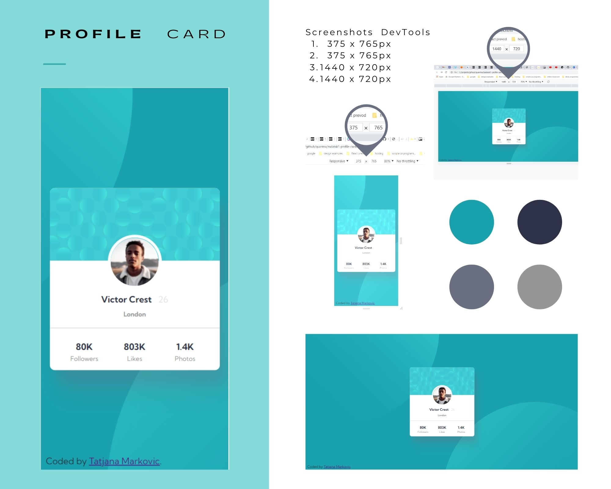
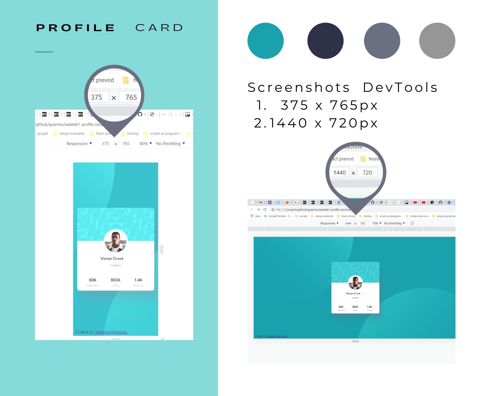
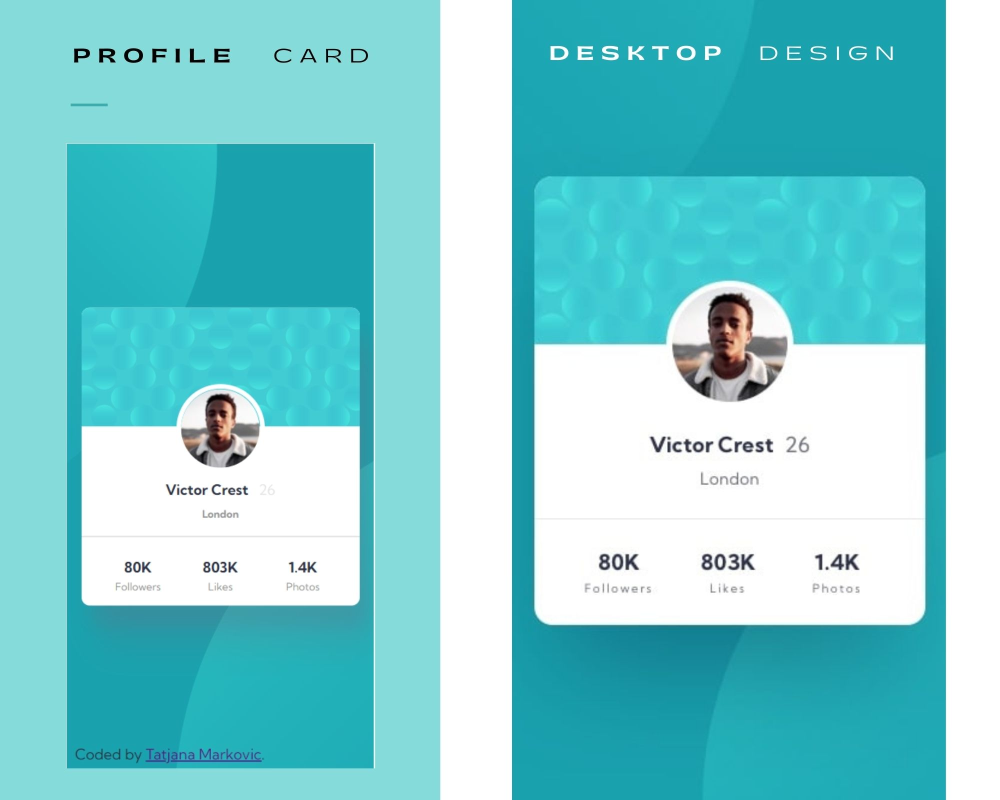
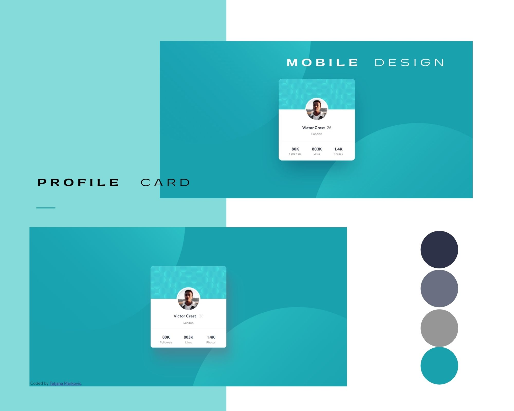
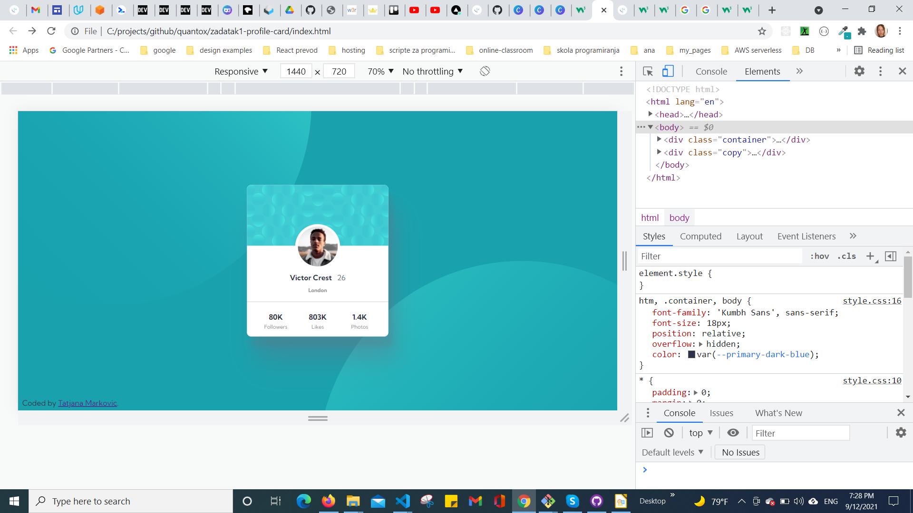
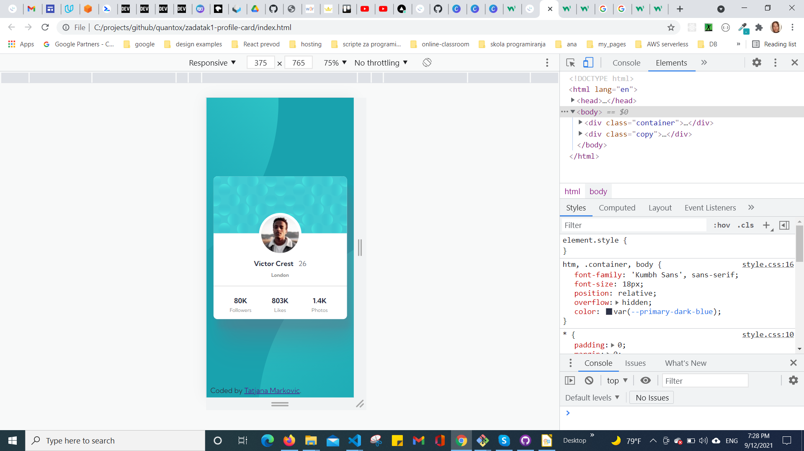
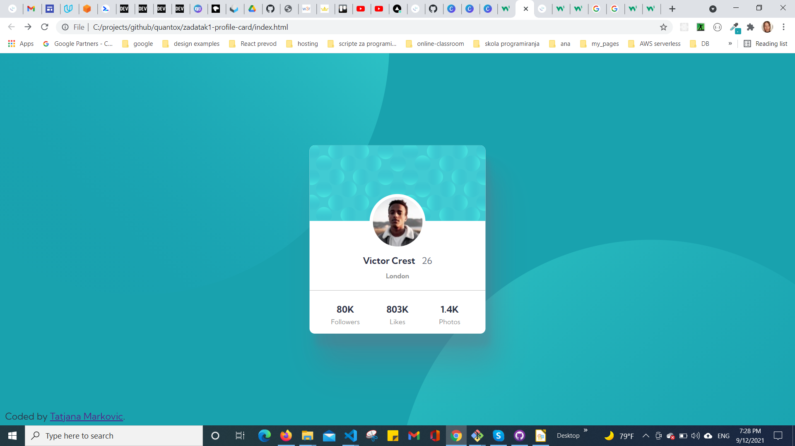

# Frontend Mentor - Profile card component solution

This is a solution to the [Profile card component challenge on Frontend Mentor](https://www.frontendmentor.io/challenges/profile-card-component-cfArpWshJ). Frontend Mentor challenges help you improve your coding skills by building realistic projects.

## Table of contents

  - [Overview](#overview)
  - [The challenge](#the-challenge)
  - [Screenshot](#screenshot)
  - [Links](#links)
  - [My process](#my-process)
  - [Built with](#built-with)
  - [Author](#author)
## Overview

This project, which seems very simple at first glance, is, in fact, incredibly complex.
In order to solve the task, I had to apply a lot of advanced CSS concepts.
### The challenge

- Build out the project to the designs provided

### Screenshot

### Links

-  [GitHub URL:](https://github.com/tatjama/zadatak1-profile-card)
-  [Live Site URL:](https://zadatak1-profile-card-psi.vercel.app/)

## My process
1. Create a new project 
2. Import starting code 
3. Initializing git repositories main and development
4. Import git repositories to the Vercel project
5. Create HTML structure
6. Import fonts to styles 
7. Create CSS Utility
8. CSS Layout style
9. Menu padding, margin, font-size...
10. Create Card shadow
11. Position background circles
12. Responsive at 768px
13. Compare original designs with my work
14. Create screenshots
15. Change README-template.md to README.md 
16. Merge develop branch into master branch
### Built with

- Semantic HTML5 markup
- Flexbox
- Media queries
- Centering elements, content and text
- Element positioning
- Box-shadows
- Customize font,width and size
- Borders
- Overflow control
- Transparency
## Author

- Website - [Tatjana Markovic](https://my-react-portfolio-tatjana.vercel.app/)
- LinkedIn - [Tatjana Marković](https://www.linkedin.com/in/tatjana-markovi%C4%87-919501189/)
- GitHub - [tatjama](https://github.com/tatjama)
